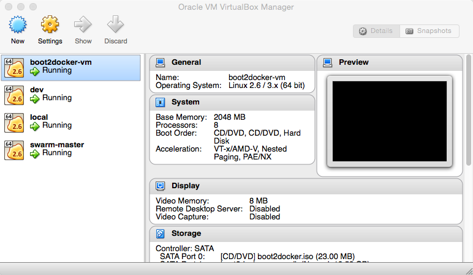

# 安装并创建 Docker Swarm

您可以使用 Docker Swarm 来管理并调度 Docker container 中的集群。本章节会通过教授您如何在您的机器上使用 Docker Machine 和 VirtualBox 创建一个 swarm 来介绍 Docker Swarm。

谨记，Docker Swarm 目前还处于测试阶段，所以很多事情都有可能会改变。我们目前不建议您在生产环境中使用。

## 前提知识

首先您要确保您已经在本地系统中安装了 VirtualBox。如果您使用的是 Mac OS X 或者 Windows 操作系统并安装了 Docker，那么您的 VirtualBox 就已经是安装好的了。

参考适合您系统架构的指南来安装 [Docker Machine](../machine/install-machine.md)。

## 创建 Docker Swarm

Docker Machine 可以让 Docker container 运行在 Docker 主机上。Docker Swarm 的每个 node 结点上都必须有访问 Docker 的权限才能 pull image 并且在 container 中运行 image。Docker Machine 为您的 swarm 管理所有需要被管理的内容。

在您使用 `docker-machine` 创建一个 swarm 之前，您需要创建一个发现标记。Docker Swarm 使用该标记来发现 node，并将 node 注册到集群当中。使用这个标记，您就可以创建一个安全的 swarm 出来了。

1. 列出您系统中所有的 Docker Machine。
```
$ docker-machine ls
NAME         ACTIVE   DRIVER       STATE     URL                         SWARM
docker-vm    *        virtualbox   Running   tcp://192.168.99.100:2376   
```

   该例是在安装了 Docker Toolbox 的 Mac OSX 系统上运行的。所以 machine 列表中现实的是 `docker-vm`。

2. 在您的系统上创建一个叫 `local` 的 VirtualBox 虚拟机。
```
$ docker-machine create -d virtualbox local
INFO[0000] Creating SSH key...                          
INFO[0000] Creating VirtualBox VM...                    
INFO[0005] Starting VirtualBox VM...                    
INFO[0005] Waiting for VM to start...                   
INFO[0050] "local" has been created and is now the active machine. 
INFO[0050] To point your Docker client at it, run this in your shell: eval "$(docker-machine env local)" 
```

3. 将 `local` 虚拟机的配置加载到您的 shell 中去。
```
$ eval "$(docker-machine env local)"
```

4. 使用 Docker Swarm image 生成一个发现标记。
下面的命令的含义是：在 container 中运行 `swarm create`。如果您的机器上还没有 `swarm:latest`，Docker 会为您下载它。

   ```
   $ docker run swarm create
   Unable to find image 'swarm:latest' locally
   latest: Pulling from swarm
   de939d6ed512: Pull complete 
   79195899a8a4: Pull complete 
   79ad4f2cc8e0: Pull complete 
   0db1696be81b: Pull complete 
   ae3b6728155e: Pull complete 
   57ec2f5f3e06: Pull complete 
   73504b2882a3: Already exists 
   swarm:latest: The image you are pulling has been verified. Important: image verification is a tech preview feature and should not be relied on to provide security.
   Digest: sha256:aaaf6c18b8be01a75099cc554b4fb372b8ec677ae81764dcdf85470279a61d6f
   Status: Downloaded newer image for swarm:latest
   fe0cc96a72cf04dba8c1c4aa79536ec3
   ```

5. 将标记保存在一个安全的地方。
在下一步中，您需要使用这个标记来创建一个 Docker Swarm。

## 开启 Swarm 管理器

在你的网络里的唯一的系统被称为 Docker Swarn 管理器。该 swarm 管理器会在整个集群上指挥调度 container，它还管理了一组 agent，即 Docker node。

Swarm agent 负责管理 container。它们是规则的 docker 后台进程，您可以使用 Docker remote API 与它们进行交互。

在本章节中，您需要创建一个 swarm 管理器和两个 node。

1. 在 VirtualBox 下创建一个 swarm 管理器。
```
docker-machine create \
        -d virtualbox \
        --swarm \
        --swarm-master \
        --swarm-discovery token://<TOKEN-FROM-ABOVE> \
        swarm-master
```

举个例子：

```
$ docker-machine create -d virtualbox --swarm --swarm-master --swarm-discovery token://fe0cc96a72cf04dba8c1c4aa79536ec3 swarm-master
INFO[0000] Creating SSH key...                          
INFO[0000] Creating VirtualBox VM...                    
INFO[0005] Starting VirtualBox VM...                    
INFO[0005] Waiting for VM to start...                   
INFO[0060] "swarm-master" has been created and is now the active machine. 
INFO[0060] To point your Docker client at it, run this in your shell: eval "$(docker-machine env swarm-master)" 
```

2. 打开您的 VirtualBox 管理器，现在这里应该包括 `local` 和 `swarm-master` 这两台虚拟机。


3. 创建一个 swarm node。
```

```
## 管理/指向 swarm

## 下面做什么？ 

