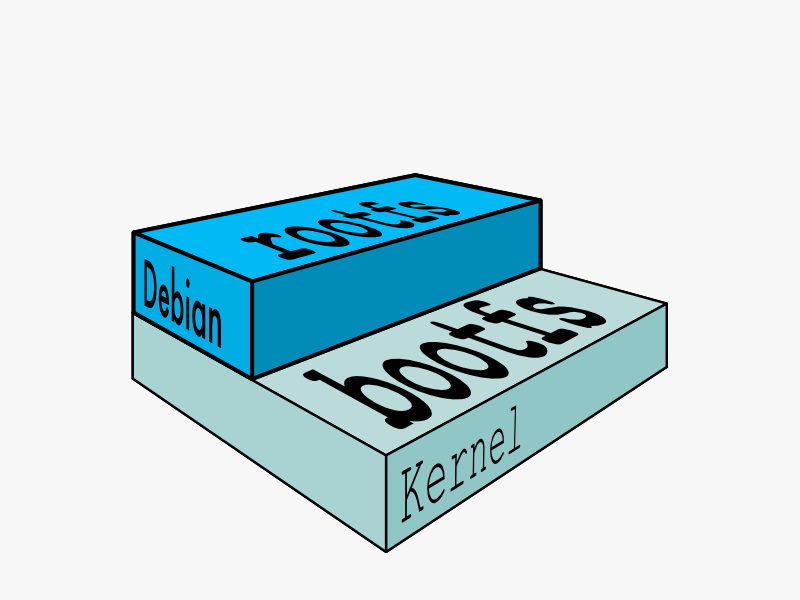
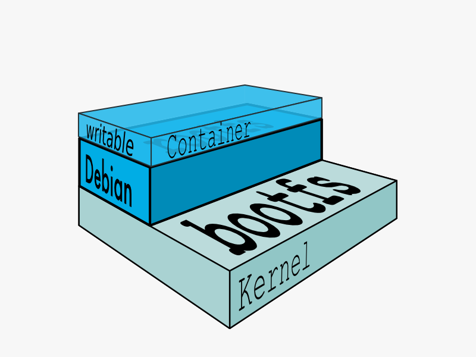

# 镜像
======

### 介绍

在 Docker 的术语里，一个只读层被称为镜像，一个镜像是永久不会变的。

由于 Docker 使用一个统一文件系统，Docker 进程认为整个文件系统是以读写方式挂载的。
但是所有的变更都发生顶层的可写层，而下层的原始的只读镜像文件并未变化。由于镜像不
可写，所以镜像是无状态的。

### 父镜像

每一个镜像都可能依赖于由一个或多个下层的组成的另一个镜像。我们有时说，下层那个
镜像是上层镜像的父镜像。

### 基础镜像

一个没有任何父镜像的镜像，谓之基础镜像。

### 镜像ID

所有镜像都是通过一个 64 位十六进制字符串 （内部是一个 256 bit 的值）来标识的。
为简化使用，前 12 个字符可以组成一个短ID，可以在命令行中使用。短ID还是有一定的
碰撞机率，所以服务器总是返回长ID。
