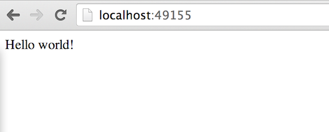

# 使用容器工作

在上一节的 Docker 用户指南中，我们启动了我们的第一个容器。而后边的例子中我们使用 `docker run` 命令启动了两个容器

+ 与前台进行交互的容器

+ 以进程方式在后台运行的容器

在这个过程中，我们学习到了几个 Docker 命令：

- `docker ps`   列出容器
- `docker logs` 显示容器的标准输出
- `docker stop` 停止正在运行的容器

>提示：另一种学习 `docker` 命令的方式就是查看我们的 [交互式教程页面。](https://www.docker.com/tryit/)

`docker` 客户端非常简单 。Docker 的每一项操作都是通过命令行来实现的，而每一条命令行都可以使用一系列的标识（flags）和参数。

	# Usage:  [sudo] docker [flags] [command] [arguments] ..
	# Example:
	$ docker run -i -t ubuntu /bin/bash

让我们看看这个使用 `docker version` 命令的操作，它将返回当前安装的 Docker 客户端和进程的版本信息。

	$ sudo docker version

这个命令不仅返回了您使用的 Docker 客户端和进程的版本信息，还返回了 GO 语言的版本信息( Docker的编程语言 )。

	Client version: 0.8.0
	Go version (client): go1.2
	
	Git commit (client): cc3a8c8
	Server version: 0.8.0
	
	Git commit (server): cc3a8c8
	Go version (server): go1.2
	
	Last stable version: 0.8.0

## 查看一下 Docker 客户端都能做什么

我们可以通过只输入不附加任何参数的 `docker` 命令来运行 docker 二进制文件，这样我们就会查看到 Docker 客户端的所有命令选项。

	$ sudo docker

会看到当前可用的所有命令行列表：

	Commands:
     attach    Attach to a running container
     build     Build an image from a Dockerfile
     commit    Create a new image from a container's changes
	 . . .

## 查看 Docker 命令用法

你可以更深入的去了解指定的 Docker 命令使用方法。

试着输入 Docker `[command]`，这里会看到 docker 命令的使用方法：

	$ sudo docker attach
	Help output . . .

或者你可以通过在 docker 命令中使用 `--help` 标识(flags)

	$ sudo docker images --help

这将返回所有的帮助信息和可用的标识(flags)：

	Usage: docker attach [OPTIONS] CONTAINER

	Attach to a running container
	
	  --no-stdin=false: Do not attach stdin
	  --sig-proxy=true: Proxify all received signal to the process (even in non-tty mode)

>注意：你可以点击[这里](https://docs.docker.com/reference/commandline/cli/) 来查看完整的 Docker 命令行列表和使用方法。

## 在Docker中运行一个web应用

到这里我们了解了更多关于 docker 客户端的知识，而现在我们需要将学习的焦点转移到重要的部分：运行多个容器。到目前为止我们发现运行的容器并没有一些什么特别的用处。让我们通过使用 docker 构建一个 web 应用程序来运行一个web应用程序来体验一下。

在这个 web 应用中，我们将运行一个 Python Flask 应用。使用 `docker run` 命令。

	$ sudo docker run -d -P training/webapp python app.py

让我们来回顾一下我们的命令都做了什么。我们指定两个标识(flags)   `-d` 和 `-P` 。我们已知是 `-d` 标识是让 docker 容器在后台运行。新的 `-P` 标识通知 Docker 将容器内部使用的网络端口映射到我们使用的主机上。现在让我们看看我们的 web 应用。

This image is a pre-built image we've created that contains a simple Python Flask web application.

我们指定了 `training/web` 镜像。我们创建容器的时候使用的是这个预先构建好的镜像，并且这个镜像已经包含了简单的 Python Flask web 应用程序。

最后，我们指定了我们容器要运行的命令： `python app.py`。这样我们的 web 应用就启动了。

>注意：你可以在[命令参考](http://docs.docker.com/reference/commandline/cli/#run)和[Docker run参考](http://docs.docker.com/reference/run/)查看更多 `docker run` 命令细节

## 查看 WEB 应用容器

现在我们使用 `docker ps` 来查看我们正在运行的容器。

	$ sudo docker ps -l
	CONTAINER ID  IMAGE                   COMMAND       CREATED        STATUS        PORTS                    NAMES
	bc533791f3f5  training/webapp:latest  python app.py 5 seconds ago  Up 2 seconds  0.0.0.0:49155->5000/tcp  nostalgic_morse

你可以看到我们在 `docker ps` 命令中指定了新的标识 `-l`。这样组合的 `docker ps` 命令会返回最后启动容器的详细信息。

>注意：默认情况下，`docker ps` 命令只显示运行中的容器。如果你还想看已经停止的容器，请加上 `-a` 标示。

我们这里可以看到一些细节，与我们第一次运行 `docker ps` 命令的时候相比，这里多了一个 `PORTS` 列。

	PORTS
	0.0.0.0:49155->5000/tcp

我们通过在 `docker run` 中使用 `-P` 标示(flags) 来将我们 Docker 镜像内部容器端口暴露给主机。

>提示：当我们学习[如何构建镜像的时候](./dockerimages.md)，我们将了解更多关于如何开放 Docker 镜像端口。

在这种情况下，Docker 开放了 5000 端口（默认 Python Flask 端口）映射到主机端口 49155 上。

Docker 能够很容易的配置和绑定网络端口。在最后一个例子中 `-P` 标识(flags)是 `-p 5000` 的缩写，它将会把容器内部的 5000 端口映射到本地 Docker 主机的高位端口上(这个端口的通常范围是 32768 至 61000)。我们也可以指定 `-p` 标识来绑定指定端口。举例：

	$ sudo docker run -d -p 5000:5000 training/webapp python app.py

这将会把容器内部的 5000 端口映射到我们本地主机的 5000 端口上。你可能现在会问：为什么我们只使用 1对1端口映射的方式将端口映射到 Docker 容器， 而不是采用自动映射高位端口的方式？这里 1:1 映射方式能够保证映射到本地主机端口的唯一性。假设你想要测试两个 Python 应用程序，两个容器内部都绑定了端口5000，这样就没有足够的 Docker 的端口映射，你只能访问其中一个。

所以，现在我们打开浏览器访问端口49155。

我们的应用程序可以访问了！

>注意：如果你在 OS X windows或者Linux上使用 boot2docker 虚拟机，你需要获取虚拟机的 ip 来代替localhost 使用，你可以通过运行 boot2docker shell 来获取 ip。

	$ boot2docker ip
	The VM's Host only interface IP address is: 192.168.59.103

>在这种情况下,你可以通过输入 http://192.168.59.103:49155 来访问上面的例子。

### 查看网络端口快捷方式

使用 `docker ps` 命令来会返回端口的映射是一种比较笨拙的方法。为此，Docker 提供了一种快捷方式： `docker port` ，使用 `docker port` 可以查看指定 （ID或者名字的）容器的某个确定端口映射到宿主机的端口号。

	$ sudo docker port nostalgic_morse 5000
	0.0.0.0:49155

在这种情况下，我们看到容器的 5000 端口映射到了宿主机的的 49155 端口。

###查看WEB应用程序日志

让我们看看我们的容器中的应用程序都发生了什么，这里我们使用学习到的另一个命令 `docker logs` 来查看。

	$ sudo docker logs -f nostalgic_morse
	* Running on http://0.0.0.0:5000/
	10.0.2.2 - - [23/May/2014 20:16:31] "GET / HTTP/1.1" 200 -
	10.0.2.2 - - [23/May/2014 20:16:31] "GET /favicon.ico HTTP/1.1" 404 -

这次我们添加了一个 `-f` 标识。 `docker log` 命令就像使用 `tail -f` 一样来输出容器内部的标准输出。这里我们从显示屏上可以看到应用程序使用的是 5000 端口并且能够查看到应用程序的访问日志。

### 查看WEB应用程序容器的进程

我们除了可以查看容器日志，我们还可以使用 `docker top` 来查看容器内部运行的进程：

	$ sudo docker top nostalgic_morse
	PID                 USER                COMMAND
	854                 root                python app.py

这里我们可以看到 `python app.py` 在容器里唯一进程。

###检查WEB应用程序

最后，我们可以使用 `docker inspect ` 来查看Docker的底层信息。它会返回一个 JSON 文件记录着 Docker 容器的配置和状态信息。

	$ sudo docker inspect nostalgic_morse

来让我们看下JSON的输出。

	[{
	    "ID": "bc533791f3f500b280a9626688bc79e342e3ea0d528efe3a86a51ecb28ea20",
	    "Created": "2014-05-26T05:52:40.808952951Z",
	    "Path": "python",
	    "Args": [
	       "app.py"
	    ],
	    "Config": {
	       "Hostname": "bc533791f3f5",
	       "Domainname": "",
	       "User": "",
	. . .

我们也可以针对我们想要的信息进行过滤，例如，返回容器的 IP 地址，如下：

	$ sudo docker inspect -f '{{ .NetworkSettings.IPAddress }}' nostalgic_morse
	172.17.0.5

###停止WEB应用容器

现在，我们的WEB应用程序处于工作状态。现在我们通过使用 `docker stop` 命令来停止名为 `nostalgic_morse` 的容器：

	$ sudo docker stop nostalgic_morse
	nostalgic_morse

现在我们使用 `docker ps` 命令来检查容器是否停止了。

	$ sudo docker ps -l

###重启WEB应用容器

哎呀！刚才你停止了另一个开发人员所使用的容器。这里你现在有两个选择：您可以创建一个新的容器或者重新启动旧的。让我们启动我们之前的容器：

	$ sudo docker start nostalgic_morse
	nostalgic_morse

现在再次运行 `docker ps -l` 来查看正在运行的容器，或者通过URL访问来查看我们的应用程序是否响应。

>注意：也可以使用 `docker restart` 命令来停止容器然后再启动容器。

###移除WEB应用容器

你的同事告诉你他们已经完成了在容器上的工作，不在需要容器了。让我们使用 `docker rm` 命令来删除它：

	$ sudo docker rm nostalgic_morse
	Error: Impossible to remove a running container, please stop it first or use -f
	2014/05/24 08:12:56 Error: failed to remove one or more containers

发生了什么？实际上，我们不能删除正在运行的容器。这避免你意外删除了正在使用并且运行中的容器。让我们先停止容器，然后再试一试删除容器。

	$ sudo docker stop nostalgic_morse
	nostalgic_morse
	$ sudo docker rm nostalgic_morse
	nostalgic_morse

现在我们停止并删除了容器。

>注意：删除容器是最后一步！

###下一步

直到现在，我们使用的镜像都是从Docker Hub下载的。接下来，我们学习创建和分享镜像。

阅读[使用镜像](dockerimages.md)
